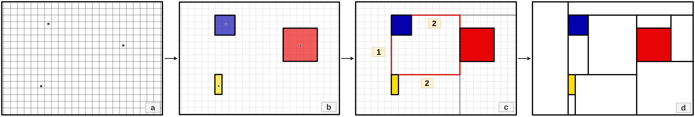
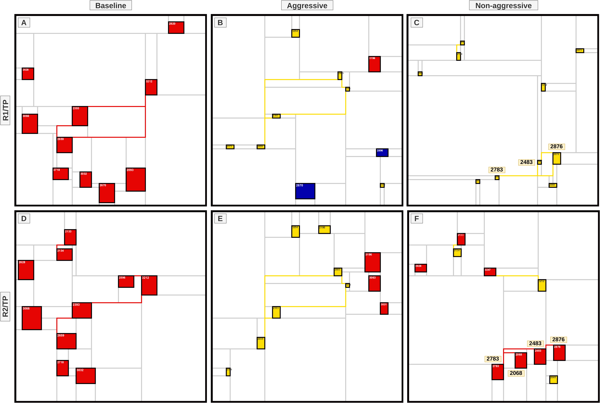

# Mondrian Map: Piet Mondrian’s Abstraction for Differential Pathway Analysis

**Project Overview:**

This repository contains notebooks and data files for conducting analysis and generating Mondrian Maps as described in a paper titled "Mondrian Map: Piet Mondrian’s Abstraction for Differential Pathway Analysis."

**Notebooks:**

The `notebooks` folder contains the following files:

1. **0-clinical-data-analysis.ipynb**: Notebook for analyzing clinical data.
2. **1-data-preprocessing.ipynb**: Notebook for preprocessing data. Generates files: genesets_FC.pkl, membership.zip, pag_before_DPA.zip, and pag_after_DPA.zip.
3. **2-mondrian-map-generation.ipynb**: Notebook for generating Mondrian Maps. Requires membership.zip and pag_after_DPA.zip from the data folder.

**Data Files:**

The `data` folder contains the following files:

1. **genesets_FC.pkl**: File generated during data preprocessing.
2. **membership.zip**: Required for generating Mondrian Maps.
3. **pag_before_DPA.zip**: File generated during data preprocessing.
4. **pag_after_DPA.zip**: Required for generating Mondrian Maps.

To generate Mondrian Maps, place `membership.zip` and `pag_after_DPA.zip` in the same folder as `2-mondrian-map-generation.ipynb`.

For detailed instructions on running the notebooks and utilizing the data files, please refer to the individual notebook files and accompanying documentation.

## Mondrian Map Generation

## Results

